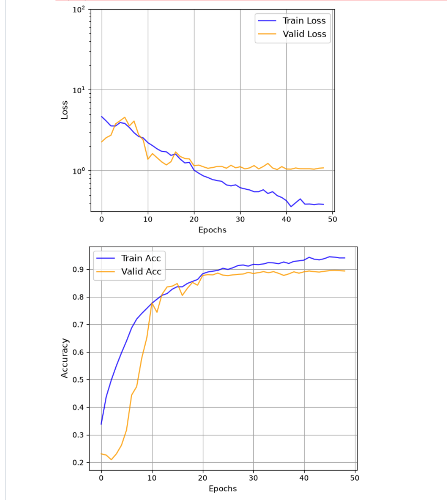

# computer-vision-class

## Intro
This repository contains code submission for competion in class on Computer Vision on prediction the right emoji vendor from 7 available options: Apple, Samsung, Google, etc. There is 9000 pictures in the training data, and 9000 pictures in the test data.

The pictures are colored PNG images in different sizes, so some data transformation is required, including grayscaling and resizing. Additionally, this notebook specifically features the training on macbook M1 (or newer) chips

## Stack
Stack: Tensorflow, Python 3.11

## How to run:

```git clone https://github.com/georgerieh/computer-vision-class.git```

```cd computer-vision-class```

```uv sync```

```Choose computer-vision-class kernel in the top right corner of the submission.ipynb notebook```

## Model Architecture

The existing sequential model architecture is:
```
Model: "sequential_3"
_________________________________________________________________
 Layer (type)                Output Shape              Param #   
=================================================================
 sequential_2 (Sequential)   (None, 72, 72, 1)         0         
                                                                 
 conv2d_3 (Conv2D)           (None, 72, 72, 32)        320       
                                                                 
 batch_normalization_3 (Bat  (None, 72, 72, 32)        128       
 chNormalization)                                                
                                                                 
 max_pooling2d_3 (MaxPoolin  (None, 35, 35, 32)        0         
 g2D)                                                            
                                                                 
 conv2d_4 (Conv2D)           (None, 35, 35, 64)        18496     
                                                                 
 batch_normalization_4 (Bat  (None, 35, 35, 64)        256       
 chNormalization)                                                
                                                                 
 max_pooling2d_4 (MaxPoolin  (None, 17, 17, 64)        0         
 g2D)                                                            
                                                                 
 dropout_2 (Dropout)         (None, 17, 17, 64)        0         
                                                                 
 conv2d_5 (Conv2D)           (None, 17, 17, 128)       73856     
                                                                 
 batch_normalization_5 (Bat  (None, 17, 17, 128)       512       
 chNormalization)                                                
                                                                 
 max_pooling2d_5 (MaxPoolin  (None, 8, 8, 128)         0         
 g2D)                                                            
                                                                 
 flatten_1 (Flatten)         (None, 8192)              0         
                                                                 
 dense_2 (Dense)             (None, 128)               1048704   
                                                                 
 dropout_3 (Dropout)         (None, 128)               0         
                                                                 
 dense_3 (Dense)             (None, 7)                 903       
                                                                 
=================================================================
Total params: 1143175 (4.36 MB)
Trainable params: 1142727 (4.36 MB)
Non-trainable params: 448 (1.75 KB)
_________________________________________________________________
```

## Accuracy
Based on the 9000 images from training dataset, we have been able to achieve ±90% accuracy and descently low loss. On the test data, our accuracy level is 88.95%

